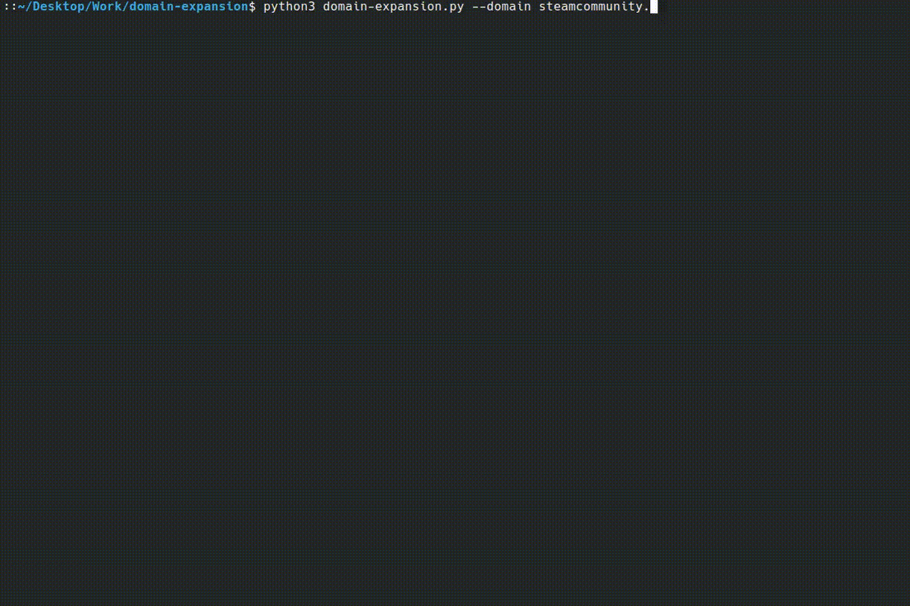

# Domain Expansion 🌀

Have you ever:

- Wanted to **stalk**—I mean **find out**—if a website has _spicy_ subdomains?
- Needed to know if your **crush** is secretly hosting a world-changing project under their own website?
- Felt the urge to **Domain Expand** like in _Jujutsu Kaisen_?

Well, my friend, I’ve got just the thing for you! What does it do? It expands (or _explores_) any domain you feed it, giving you all the juicy info you crave. Subdomains? Got 'em. Colors that will make your eyes do a happy dance? Oh, you better believe it.

## 🎥 **Demo time!**



_Warning: This tool’s UI contains colors so vibrant, your screen might start demanding royalties._ 🌈

## ⚙️ **Features**

- **Domain exploration:** Feed it a domain, and watch it expand your world.
- **Subdomain discovery:** It finds 'em all—big ones, small ones, and the ones your crush probably forgot to hide.
- **Tree view output:** Displays domains and subdomains in an orderly and visually satisfying tree view. Perfect for staying organized while looking awesome.
- **Customizable colors:** Want rainbows to explode on your screen? Done. Prefer a more _boring_ (no offense) grayscale look? We got you. Adjust the color settings to match your vibe.
- **Now in Rust!** Faster, safer, and cooler. The Rust version is optimized for speed and reliability, so you can expand domains with efficiency and style.

## 🔧 **How to use**

Clone this repository because you’re smart and make good life decisions:

```bash
    git clone https://github.com/naghim/domain-expansion.git
```

Navigate into the domain of awesomeness:

```bash
    cd domain-expansion
```

Now, you must choose your preferred language.

### Python version

If you prefer Python, enter the subfolder:

```bash
    cd python
```

Run the magic:

```bash
    python domain-expansion.py --domain example.com
```

### Rust version

If you prefer Rust, then build and run:

```bash
    cargo run
```

> Note:
> In order to disable the coloring, use the `--no-color` or `-n` flag.

And lastly, customize your Domain Expansion colors (if you dare).

## 👀 Why use this tool?

- ~~It's like stalking~~. The internet’s full of secrets—time to ethically spill some tea!
- Be the cool friend who finds hidden websites effortlessly.
- Domain Expansion sounds awesome.
